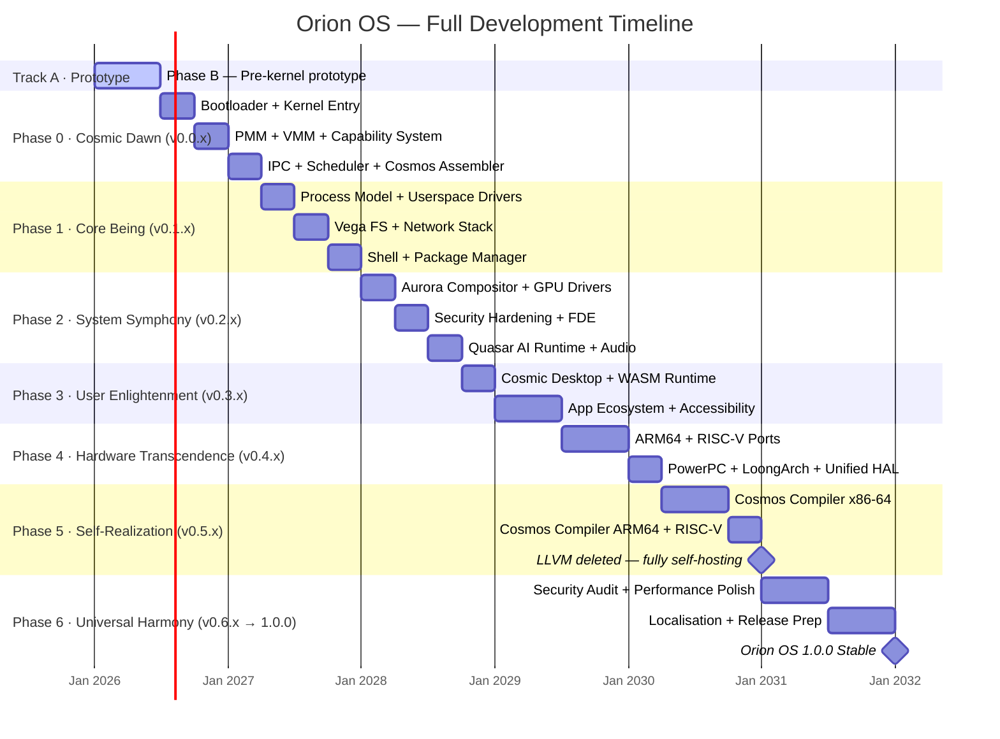

## Visual Timeline

```
2026          2027          2028          2029          2030          2031          2032
 │             │             │             │             │             │             │
 ├─[Phase B]───┤             │             │             │             │             │
 │  Pre-kernel │             │             │             │             │             │
 │  (Track A)  │             │             │             │             │             │
 │             ├─[Phase 0]───┤             │             │             │             │
 │             │  Cosmic     │             │             │             │             │
 │             │  Dawn       │             │             │             │             │
 │             │             ├─[Phase 1]───┤             │             │             │
 │             │             │  Core Being │             │             │             │
 │             │             │             ├─[Phase 2]───┤             │             │
 │             │             │             │  System     │             │             │
 │             │             │             │  Symphony   │             │             │
 │             │             │             │             ├─[Phase 3]───┤             │
 │             │             │             │             │  User       │             │
 │             │             │             │             │  Enlighten. │             │
 │             │             │             │             ├─[Phase 4]───┤             │
 │             │             │             │             │  Hardware   │             │
 │             │             │             │             │  Transcend. │             │
 │             │             │             │             │             ├─[Phase 5]───┤
 │             │             │             │             │             │  Self-      │
 │             │             │             │             │             │  Realization│
 │             │             │             │             │             │             ├─[1.0.0]
```

### Mermaid Gantt (renders in Docusaurus)


