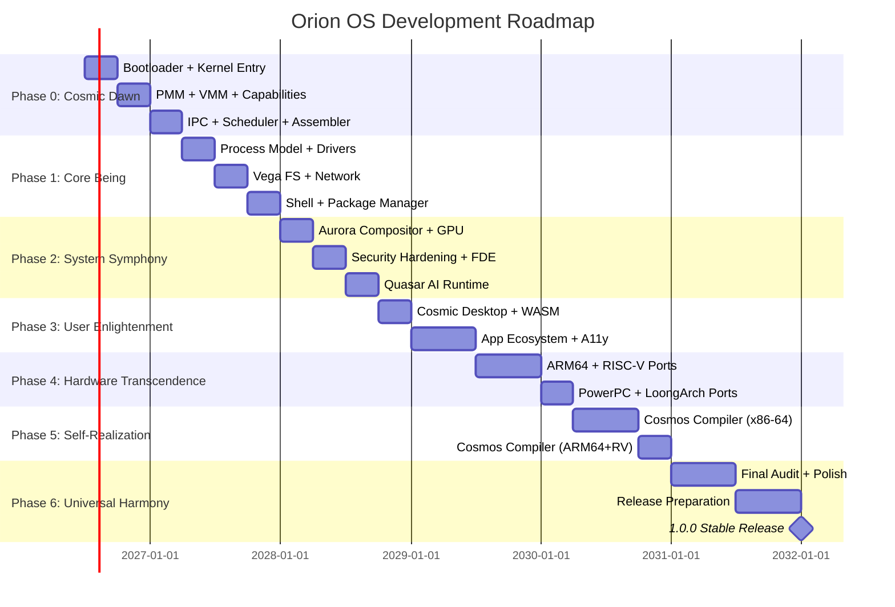

# 🌌 Orion OS: The Complete Development Roadmap

&gt; **Internal Team Guide v1.0**
&gt; *From Bare Metal to Cosmic Harmony — A Philosophical Journey in 7 Phases*
&gt; *Last Updated: May 2026*

---

## 📋 Quick Navigation

| Phase | Name | Version | Color | Status |
|-------|------|---------|-------|--------|
| [Phase 0](#-phase-0-cosmic-dawn) | Cosmic Dawn | 0.0.x | 🟣 Deep Purple | ⬜ 0% |
| [Phase 1](#-phase-1-core-being) | Core Being | 0.1.x | 🔵 Cobalt Blue | ⬜ 0% |
| [Phase 2](#-phase-2-system-symphony) | System Symphony | 0.2.x | 🟢 Emerald Green | ⬜ 0% |
| [Phase 3](#-phase-3-user-enlightenment) | User Enlightenment | 0.3.x | 🟡 Golden Yellow | ⬜ 0% |
| [Phase 4](#-phase-4-hardware-transcendence) | Hardware Transcendence | 0.4.x | 🔴 Crimson | ⬜ 0% |
| [Phase 5](#-phase-5-self-realization) | Self-Realization | 0.5.x | 🟣 Magenta | ⬜ 0% |
| [Phase 6](#-phase-6-universal-harmony) | Universal Harmony | 0.6.x → 1.0.0 | ⚪ White | ⬜ 0% |

---

## 📊 Orion OS Development Timeline (Mermaid)



---

## 🌅 Phase 0: Cosmic Dawn

&gt; *"From void to first light — establishing the fundamental laws"*

**Version Target:** 0.0.1 → 0.0.3 (Pre-Alpha)
**Estimated Duration:** 6–9 months (Q3 2026 → Q2 2027)
**Status:** ⬜ 0% Complete

### Philosophy

&gt; **"The first principle is that there must be first principles."**

- **Goal:** Create the minimal, unchangeable foundation that all else builds upon
- **Metaphor:** The Big Bang of our OS universe
- **Key Insight:** If the foundation is flawed, the entire structure collapses
- **Rule:** Nothing borrowed in the kernel core. Everything understood, everything owned.

### Architecture Map

```
Hardware
  └── HAL: Hardware Abstraction Layer (DDR-HAL)
        └── Bootloader (Horizon Boot)
              └── Kernel Entry
                    ├── Early Console
                    └── Kernel Main
                          ├── PMM (Physical Memory Manager)
                          ├── VMM (Virtual Memory Manager)
                          ├── Capability System (DDR-002)
                          ├── IPC Primitives (DDR-006)
                          └── Scheduler (DDR-005)
```

### Task Tracker

| **Task** | **Status** | **Owned Component** | **DDR** | **Security Rules** | **Testing** |
|----------|------------|---------------------|---------|---------------------|-------------|
| UEFI Bootloader (Horizon Boot) | ⬜ | horizon-boot (Rust + ASM) | DDR-011 | Constant-time ops, TPM PCR measurement, Dilithium3 verify | QEMU boot, tamper tests, TPM validation |
| BIOS Bootloader (legacy) | ⬜ | horizon-boot-bios (ASM) | DDR-011 | No dynamic alloc, static buffers only | Legacy BIOS QEMU boot |
| Kernel Entry Point | ⬜ | kernel_entry.asm | DDR-001 | Disable interrupts, pure ASM, &lt;500 lines | GDB step-through, interrupt tests |
| GDT + IDT Setup | ⬜ | cosmos_gdt / cosmos_idt | DDR-001 | All 256 IDT handlers in ASM, dispatch to Rust | Interrupt injection tests |
| Early Console | ⬜ | cosmos_console | DDR-001 | No heap, no panic handlers, fail-safe output | VGA + UEFI framebuffer output |
| SMP Boot (AP startup) | ⬜ | cosmos_smp | DDR-005 | Atomic AP startup, no race conditions | Bring up N cores in QEMU |
| CPU Feature Detection | ⬜ | cosmos_cpu | DDR-010 | CPUID validation, disable unverified features | Feature matrix test on all target CPUs |
| Physical Memory Manager | ⬜ | cosmos_pmm (Buddy) | DDR-003 | Safe Rust, 4KB alignment, zero on free, no unsafe | Alloc/free stress test, Kani verification |
| Virtual Memory Manager | ⬜ | cosmos_vmm | DDR-003 | 4-level PML4, ASLR, no TLB storms, no kernel leaks | Page walk fuzzing, ASLR entropy tests |
| Capability System | ⬜ | cosmos_caps | DDR-002 | Atomic check-and-use, CAP_LOCK, no ambient authority | Capability fuzzing, TOCTOU tests, Kani |
| IPC Fast Path | ⬜ | cosmos_ipc | DDR-006 | Zero-copy, capability-gated, &lt;500ns, caller-ID in every msg | IPC fuzzing, latency benchmarks |
| Scheduler (Base) | ⬜ | cosmos_sched | DDR-005 | 5 scheduling classes, tickless, no starvation | 10K thread stress test, latency measurements |
| Cosmos Assembler (replaces NASM) | ⬜ | cosmos-asm (Rust) | DDR-IR | No unsafe in assembler core, reproducible output | Bootstrap test: assembles own output identically |

### Best Practices

| **Component** | **Implementation Rules** | **Security Rules** | **Performance Targets** |
|---------------|--------------------------|---------------------|------------------------|
| Bootloader | No dynamic alloc, &lt;1000 LOC, verify signatures before boot | Constant-time comparisons, TPM measurement, no network | Boot &lt;1s (QEMU), &lt;5s (real HW) |
| Kernel Entry | Pure ASM, &lt;500 lines, disable interrupts immediately | No C, static buffers, no heap | &lt;100ms to Rust entry |
| Early Console | Static buffers, no panic, colour-coded error levels | No dynamic allocation, fail-safe output | Immediate output, no blocking |
| PMM | Safe Rust, 4KB alignment, zero on free | No unsafe blocks, bounds checking on every alloc | Alloc/free in &lt;1µs |
| VMM | 4-level tables, ASLR, no TLB flush storms | No kernel memory leaks, access validation at every boundary | Page fault handler &lt;500ns |
| Capability System | Atomic checks, intent-based, reference counting | No ambient authority, CAP_LOCK for critical sections | Cap lookup &lt;200ns |
| IPC | Zero-copy for large payloads, &lt;500ns latency for small | Capability-gated, caller-ID verified in every message | Small msg &lt;500ns, large msg zero-copy |

### Common Pitfalls

| **Pitfall** | **Why It Happens** | **How to Avoid** | **DDR** |
|-------------|---------------------|------------------|---------|
| Bootloader hangs in QEMU | Incorrect UEFI exit call | Use `exit_boot_services()` correctly | DDR-011 |
| Kernel signature verification fails | Wrong public key or algorithm | Use Dilithium3 with correct key material | DDR-011 |
| Early console prints garbage | VGA buffer not initialised | Initialise VGA buffer before any write | DDR-001 |
| PMM allocator crashes | Race condition in alloc/free | Use atomic operations; verify with Kani | DDR-003 |
| Capability system deadlocks | Circular capability dependencies | Never allow cycles in capability graph; static analysis | DDR-002 |
| IPC message corruption | Buffer overflows in message handling | Always validate message sizes before copy | DDR-006 |
| TOCTOU race in capability check | Check at entry, use after revocation | Re-validate at every kernel boundary crossing | DDR-002 |

### Phase 0 Exit Criteria

&gt; **Before proceeding to Phase 1, all of the following must be ✅ Done:**

- [ ] All Phase 0 tasks above are **Done**
- [ ] **Cosmos Assembler** replaces NASM
- [ ] **Kani verification passes** for: Bootloader, Kernel Entry, PMM, VMM, Capability System, IPC
- [ ] **CI/CD pipeline** is operational: automated builds, unit tests, QEMU boot tests
- [ ] **Security audit** completed for all Phase 0 components
- [ ] **Team review** of all Phase 0 components
- [ ] QEMU boots and prints `ORION OK`

**Estimated Time:** 6–9 months | **Blockers:** None | **Next:** Phase 1: Core Being

---

## 🌙 Phase 1: Core Being

&gt; *"The first principle is that there must be first principles — the kernel breathes"*

**Version Target:** 0.1.0 → 0.1.2 (Alpha)
**Estimated Duration:** 6–9 months (Q3 2027 → Q1 2028)
**Status:** ⬜ 0% Complete

### Philosophy

&gt; **"A being exists. A being acts. A being creates."**

- **Goal:** Create the minimal, unchangeable foundation that all else builds upon
- **Metaphor:** The Big Bang of our OS universe — the kernel comes alive
- **Key Insight:** Interfaces matter more than implementations at this stage

### Architecture Map

```
Phase 1: Core Being
├── Process Model
│     ├── Processes (no fork, spawn only)
│     └── Scheduler (enhanced from Phase 0)
├── Driver Framework
│     ├── orion-driver model
│     ├── virtio-blk (QEMU storage)
│     ├── NVMe driver
│     └── AHCI driver
├── Filesystem
│     ├── Vega FS (DDR-009)
│     └── vega-vfsd (userspace daemon)
└── Networking
      ├── ether-d (network stack)
      ├── orion-pf (firewall)
      └── Network drivers (Intel, Realtek)
```

### Task Tracker

| **Task** | **Status** | **Owned Component** | **DDR** | **Security Rules** | **Testing** |
|----------|------------|---------------------|---------|---------------------|-------------|
| Process Model (no fork) | ⬜ | cosmos_process | DDR-004 | Explicit caps on spawn, no ambient authority | Spawn tests, capability leak detection |
| Scheduler (Full) | ⬜ | cosmos_sched v2 | DDR-005 | No starvation, fairness guarantees, no priority inversion | 10K thread stress test, context switch benchmark |
| Driver Model | ⬜ | orion-driver | DDR-007 | Userspace only, IOMMU mandatory, capability-gated | Driver crash tests, IOMMU validation |
| virtio-blk Driver | ⬜ | orion-virtio-blk | DDR-007 | Async I/O, capability-gated, IOMMU | Fuzz testing, QEMU block device validation |
| NVMe Driver | ⬜ | orion-nvme | DDR-007 | DMA protection, IOMMU mandatory | Benchmark vs Linux, fuzz testing |
| AHCI / SATA Driver | ⬜ | orion-ahci | DDR-007 | Capability-gated, no kernel access | Legacy hardware boot tests |
| Vega FS | ⬜ | vega-fs | DDR-009 | BLAKE3 per-block checksums, CoW, no silent corruption | Crash recovery, filesystem fuzzing |
| vega-vfsd | ⬜ | vega-vfsd | DDR-VFS | Per-process namespaces, capability-gated | Path fuzzing, namespace isolation tests |
| ether-d (network stack) | ⬜ | ether-d | DDR-011 | Zero-copy, default-deny, no raw sockets | Packet fuzzing, latency tests |
| orion-pf (firewall) | ⬜ | orion-pf | DDR-PF | No inbound by default, DNS-over-TLS | Rule fuzzing, DNS leak tests |
| Intel e1000e / igb | ⬜ | orion-net-intel | DDR-007 | IOMMU, capability-gated | Throughput benchmark |
| Realtek r8169 | ⬜ | orion-net-realtek | DDR-007 | IOMMU, capability-gated | Consumer hardware test |
| Orion Libc | ⬜ | orion-libc (musl-inspired) | DDR-014 | Safe string ops, no buffer overflows, UTF-8 | 100% coverage, string fuzzing |
| Pulsar Shell | ⬜ | pulsar-sh | DDR-004 | No fork, no shell injection, capability-gated | 10K command stress test |
| orion-init | ⬜ | orion-init | DDR-INIT | No deadlocks, DAG ordering, parallel startup | Service dependency tests, boot &lt;2s |
| Comit Package Manager (v1) | ⬜ | comit | DDR-COMIT | Signed packages only, 9-step atomic install | 100 package install/remove cycle |

### Best Practices

| **Component** | **Implementation Rules** | **Security Rules** | **Performance Targets** |
|---------------|--------------------------|---------------------|------------------------|
| Process Model | No fork(), spawn() only, explicit caps | Capability isolation, no ambient authority | Spawn &lt;1ms |
| Scheduler | Tickless, topology-aware | Fairness guarantees, no priority inversion | Context switch &lt;1µs |
| Driver Model | Userspace, IOMMU mandatory | DMA protection, no kernel access from drivers | Driver load &lt;100ms |
| Vega FS | B+ tree, CoW, BLAKE3 checksums | Per-block checksums, no silent corruption | Crash recovery &lt;1s |
| ether-d | Zero-copy, userspace TCP/IP | Default-deny, no kernel networking access | Throughput ≥ Linux |
| orion-pf | Capability-based rules, DNS-over-TLS | No inbound by default, no leaks | Rule processing &lt;1ms |
| orion-libc | UTF-8, safe string ops | No buffer overflows, bounds checking | All functions &lt;1µs |
| orion-init | DAG ordering, parallel startup | No deadlocks, capability-gated service start | Boot &lt;2s to userspace |

### Common Pitfalls

| **Pitfall** | **Why It Happens** | **How to Avoid** | **DDR** |
|-------------|---------------------|------------------|---------|
| Process spawn hangs | Deadlock in capability system during spawn | Use timeout-based capability checks; stress test spawn | DDR-002 |
| Scheduler starvation | Incorrect priority handling in mixed workloads | Test with 10K threads of mixed priority classes | DDR-005 |
| Driver crashes system | Kernel-mode assumption in userspace driver | All drivers 100% userspace; crash = process restart | DDR-007 |
| Filesystem corruption | Missing checksum validation on read | Always validate BLAKE3 checksums before returning data | DDR-009 |
| Network packet leaks | Incorrect capability enforcement in ether-d | Default-deny for all outbound; explicit capability required | DDR-PF |
| Shell command injection | Unsafe string handling in Pulsar | Use safe Rust for all string operations | DDR-004 |
| Service startup deadlocks | Circular dependencies in orion-init | Use Kahn's algorithm; static analysis of dependency graph | DDR-INIT |

### Phase 1 Exit Criteria

&gt; **Before proceeding to Phase 2, all of the following must be ✅ Done:**

- [ ] All Phase 1 tasks above are **Done**
- [ ] **Self-hosting toolchain** functional: Cosmos Assembler + Cosmos Linker operational
- [ ] **Basic hardware support** verified: QEMU (UEFI and BIOS) + at least 1 real x86-64 machine
- [ ] **Package manager** (comit) operational: install/remove/update + atomic rollback
- [ ] **All Phase 1 DDRs** locked and implemented
- [ ] **Security audit** completed for all Phase 1 components
- [ ] Boots on real hardware and prints `ORION OK`

**Estimated Time:** 6–9 months | **Blockers:** None | **Next:** Phase 2: System Symphony

---

## 🎵 Phase 2: System Symphony

&gt; *"Individual notes become a melody — integrating the subsystems"*

**Version Target:** 0.2.0 → 0.2.2 (Beta)
**Estimated Duration:** 6–9 months (Q2 2028 → Q4 2028)
**Status:** ⬜ 0% Complete

### Philosophy

&gt; **"The whole is greater than the sum of its parts."**

- **Goal:** Create a cohesive system where components work in harmony
- **Metaphor:** An orchestra where each instrument plays its part perfectly
- **Key Insight:** Interfaces matter more than implementations

### Architecture Map

```
Phase 2: System Symphony
├── Display System
│     ├── Aurora Compositor (DDR-COMPOSITOR)
│     ├── Intel GPU Driver
│     ├── AMD GPU Driver
│     └── Input Drivers
├── Package Management
│     ├── comit v2 (full)
│     └── Nebula Hub (package registry)
├── Security Hardening
│     ├── orion-cryptod (DDR-025)
│     └── Full Disk Encryption (DDR-FDE)
└── AI / ML Integration
      ├── Quasar Runtime (DDR-017)
      └── orion-mld (DDR-019)
```

### Task Tracker

| **Task** | **Status** | **Owned Component** | **DDR** | **Security Rules** | **Testing** |
|----------|------------|---------------------|---------|---------------------|-------------|
| Aurora Compositor | ⬜ | aurora | DDR-COMPOSITOR | No tearing, capability-gated, no kernel copies | &lt;8ms/frame at 60Hz, VRR tests |
| Intel GPU Driver (xe/i915) | ⬜ | orion-gpu-intel | DDR-015 | IOMMU, VRAM quota enforcement | FPS benchmark, no GPU hangs |
| AMD GPU Driver (amdgpu) | ⬜ | orion-gpu-amd | DDR-015 | IOMMU, VRAM quota enforcement | FPS benchmark, RADV Vulkan |
| Input Drivers | ⬜ | orion-input | DDR-007 | Capability-gated, no raw input access | 100+ device types, &lt;16ms latency |
| comit Package Manager (v2) | ⬜ | comit | DDR-COMIT | Signed only, PubGrub resolution, 9-step atomic | 1000 packages, no conflicts |
| Nebula Hub | ⬜ | nebula-hub | DDR-COMIT | Dilithium3 signatures, typosquatting protection | Fuzz uploads, signed metadata |
| orion-cryptod | ⬜ | orion-cryptod | DDR-025 | SGX/TrustZone enclave, TPM-sealed keys | Crypto fuzzing, TPM validation |
| Full Disk Encryption | ⬜ | vega-fs + FDE | DDR-FDE | TPM-bound keys, BIP39 recovery, RAM scramble | Power loss test, cold boot test |
| Gaming Subsystem | ⬜ | orion-gaming | DDR-015 | Real-time class, TPM-based anti-cheat attestation | FPS ≥ Windows benchmark |
| Quasar Runtime | ⬜ | quasar-runtime | DDR-017 | Shared weights, no data leaks, NPU scheduling | Inference latency &lt;10ms |
| orion-mld | ⬜ | orion-mld | DDR-019 | Hints only (not commands), no kernel control | &lt;1% false positives |
| Audio (Void Audio Server) | ⬜ | void-audio | DDR-AUDIO | AudioCapability model, PipeWire-compatible | 4 buffer modes, pro audio test |
| WiFi Drivers (Intel AX210) | ⬜ | orion-wifi-intel | DDR-007 | Capability-gated, IOMMU | WPA3 validation, link speed test |
| Bluetooth HCI | ⬜ | orion-bt | DDR-007 | Capability-gated, pairing security | Profile tests (A2DP, HID) |

### Best Practices

| **Component** | **Implementation Rules** | **Security Rules** | **Performance Targets** |
|---------------|--------------------------|---------------------|------------------------|
| Aurora Compositor | GPU-accelerated, VRR/HDR, direct scanout | No tearing, capability-gated, no kernel copies | &lt;8ms/frame at 60Hz |
| GPU Drivers | Userspace, IOMMU, unified memory | VRAM quotas enforced, DMA protection | FPS ≥ Linux/Windows |
| comit | Atomic installs, signed packages, PubGrub | No unsigned installs, signed metadata | Install &lt;1s, rollback instant |
| orion-cryptod | SGX/TrustZone, TPM binding | Enclave isolation, sealed keys | Crypto ops &lt;1ms |
| FDE | AES-256-XTS, Argon2id, TPM sealing | TPM-bound keys, BIP39 recovery | Encryption &lt;1GB/s |
| Quasar Runtime | Model caching, NPU scheduling | Shared weights, no data collection | Inference &lt;10ms |
| Gaming Subsystem | Real-time class, DirectStorage-like | Kernel attestation for anti-cheat | FPS ≥ Windows |

### Common Pitfalls

| **Pitfall** | **Why It Happens** | **How to Avoid** | **DDR** |
|-------------|---------------------|------------------|---------|
| Compositor tearing | Incorrect VRR/atomic framebuffer swap | Use atomic framebuffer swaps; test with VRR monitor | DDR-COMPOSITOR |
| GPU driver crashes | Missing IOMMU DMA validation | Always validate DMA mappings; crash = process restart | DDR-015 |
| Package conflicts | Incorrect PubGrub dependency resolution | Extensive resolution stress tests with 1000 packages | DDR-COMIT |
| Encryption key loss | Missing TPM backup procedure | Require BIP39 recovery mnemonic before enabling FDE | DDR-FDE |
| Anti-cheat bypass | Weak kernel attestation | TPM-based PCR attestation for gaming mode | DDR-015 |
| AI model poisoning | Unvalidated model inputs | Sanitise all model inputs; validate ONNX graph structure | DDR-017 |

### Phase 2 Exit Criteria

- [ ] All Phase 2 tasks above are **Done**
- [ ] **Full desktop environment** functional: Aurora compositor + GPU acceleration + input drivers
- [ ] **Package ecosystem** operational: 100+ packages in Nebula Hub, comit install/update/rollback working
- [ ] **Security hardening** complete: FDE enabled, orion-cryptod operational, orion-pf configured
- [ ] **AI/ML integration** tested: Quasar Runtime + orion-mld operational
- [ ] **Security audit** completed for all Phase 2 components

**Estimated Time:** 6–9 months | **Blockers:** GPU driver development | **Next:** Phase 3: User Enlightenment

---

## 🌞 Phase 3: User Enlightenment

&gt; *"The system becomes tangible — empowering the user"*

**Version Target:** 0.3.0 → 0.3.2 (Beta → Release Candidate)
**Estimated Duration:** 6–9 months (Q1 2029 → Q3 2029)
**Status:** ⬜ 0% Complete

### Philosophy

&gt; **"Technology should adapt to humans, not the other way around."**

- **Goal:** Create an intuitive, powerful interface that feels natural
- **Metaphor:** A garden where users grow their digital lives
- **Key Insight:** The best interface is one you don't notice

### Architecture Map

```
Phase 3: User Enlightenment
├── Desktop Environment
│     ├── Cosmic Desktop (Orion's DE)
│     ├── Window Manager
│     └── Desktop Shell
├── Application Ecosystem
│     ├── WASM Runtime (DDR-COMIT)
│     ├── Native Apps (Rust + Orion UI)
│     └── App Store (Nebula Hub v2)
├── Accessibility
│     ├── Screen Reader
│     ├── Keyboard Navigation
│     └── Voice Control
└── User Experience
      ├── Zen Mode (focus)
      └── Orion AI Assistant (local LLM)
```

### Task Tracker

| **Task** | **Status** | **Owned Component** | **DDR** | **Security Rules** | **Testing** |
|----------|------------|---------------------|---------|---------------------|-------------|
| Cosmic Desktop (Orion DE) | ⬜ | cosmic | DDR-COMPOSITOR | No data collection, capability-gated | Eye-tracking usability, &lt;100ms UI response |
| Window Manager | ⬜ | cosmic-wm | DDR-COMPOSITOR | Capability-gated, no window injection | 10K window ops, no crashes |
| WASM Runtime | ⬜ | quasar-wasm | DDR-COMIT | Sandbox by default, WASI-compatible, no syscall bypass | 100% coverage, fuzz testing |
| Native App Framework | ⬜ | orion-ui | — | No raw OS calls, sandboxed, declarative | 1000 widget stress test |
| App Store (Nebula Hub v2) | ⬜ | nebula-hub-v2 | DDR-COMIT | Sandboxed installs, signed only, no tracking | 100K user simulation |
| Accessibility (Screen Reader) | ⬜ | cosmic-a11y | — | ARIA-compliant, no data collection | WCAG AAA compliance audit |
| Keyboard Navigation | ⬜ | cosmic-a11y | — | All UI keyboard-navigable | Full keyboard-only usage test |
| Voice Control | ⬜ | orion-voice | DDR-019 | Local processing only, no cloud | 500 voice command test |
| Zen Mode | ⬜ | cosmic-ui | — | No notifications, no tracking | 8-hour focus test |
| Orion AI Assistant | ⬜ | orion-assist | DDR-017 | Local LLM only, privacy-first, no cloud | 500 prompts, hallucination rate &lt;1% |
| Desktop Shell | ⬜ | cosmic-shell | — | Extensible, no tracking | 10K customisation test |
| Linux App Compatibility Layer | ⬜ | posix-compat | DDR-POSIX | Sandboxed, signed ELF policy, no setuid | 100 Linux app compatibility test |

### Best Practices

| **Component** | **Implementation Rules** | **Security Rules** | **Performance Targets** |
|---------------|--------------------------|---------------------|------------------------|
| Cosmic Desktop | Modular, AI-powered layout, themeable | No data collection, capability-gated | &lt;100ms UI response |
| WASM Runtime | Sandbox by default, WASI-compatible | Memory safety, no syscall bypass | &lt;1ms startup |
| App Store | Signed apps, user reviews | Sandboxed installs, no tracking | Install &lt;1s |
| Accessibility | Screen reader, voice control, high contrast | ARIA-compliant, no data collection | WCAG AAA compliance |
| AI Assistant | Local LLM, context-aware | No cloud dependency, no data collection | &lt;1s response |

### Phase 3 Exit Criteria

- [ ] All Phase 3 tasks above are **Done**
- [ ] **Full desktop** usable: Cosmic Desktop + Window Manager + basic apps
- [ ] **WASM runtime** operational: sandbox working, performance acceptable
- [ ] **100+ apps** in App Store; comit handles app distribution
- [ ] **Accessibility** implemented: screen reader + keyboard nav + WCAG AAA
- [ ] **User testing** completed with positive feedback
- [ ] **Security audit** completed

**Estimated Time:** 6–9 months | **Blockers:** WASM performance, app ecosystem | **Next:** Phase 4: Hardware Transcendence

---

## 🌍 Phase 4: Hardware Transcendence

&gt; *"Breaking the chains of architecture — true hardware freedom"*

**Version Target:** 0.4.0 → 0.4.2 (Release Candidate)
**Estimated Duration:** 9–12 months (Q4 2029 → Q2 2030)
**Status:** ⬜ 0% Complete

### Philosophy

&gt; **"Hardware is but a vessel for the software soul."**

- **Goal:** Run Orion OS on any architecture without compromise
- **Metaphor:** A chameleon that adapts perfectly to its environment
- **Key Insight:** True portability comes from abstraction, not compromise

### Architecture Map

```
Phase 4: Hardware Transcendence
├── ARM64 Port
│     ├── cosmos-hal-arm64 (MTE, big.LITTLE)
│     └── ARM64 Drivers (Raspberry Pi 4, Apple M-series compat)
├── RISC-V Port
│     ├── cosmos-hal-riscv (PMP, vector extensions)
│     └── RISC-V Drivers (VisionFive 2, StarFive)
├── PowerPC Port
│     ├── cosmos-hal-powerpc (SMT, little-endian)
│     └── PowerPC Drivers
├── LoongArch Port
│     ├── cosmos-hal-loongarch (LSX/lasx)
│     └── LoongArch Drivers
└── Multi-Arch Testing
      ├── Cross-arch CI pipeline
      └── Arch-specific optimisations
```

### Task Tracker

| **Task** | **Status** | **Owned** | **DDR** | **Security Rules** | **Testing** |
|----------|------------|-----------|---------|---------------------|-------------|
| ARM64 Port | ⬜ | cosmos-hal-arm64 | DDR-HAL + DDR-022 | ARM MTE mandatory, no raw pointer access | Raspberry Pi 4 boot, QEMU arm64, stress tests |
| RISC-V Port | ⬜ | cosmos-hal-riscv | DDR-HAL | PMP mandatory, no memory safety bypass | VisionFive 2 boot, QEMU riscv64 |
| PowerPC Port | ⬜ | cosmos-hal-powerpc | DDR-HAL | Memory protection, no speculative execution leaks | PowerPC machine, QEMU ppc64 |
| LoongArch Port | ⬜ | cosmos-hal-loongarch | DDR-HAL | Memory protection, no side channels | LoongArch machine, QEMU loongarch64 |
| Multi-Arch HAL | ⬜ | cosmos-hal | DDR-HAL | No arch-specific vulnerabilities in unified interface | Cross-arch CI, performance benchmarks |
| Cross-Arch CI Pipeline | ⬜ | orion-test | DDR-023 | No arch-specific test bypasses | CI for all 5 architectures, regression tests |
| ARM64 GPU Drivers (Mali) | ⬜ | orion-gpu-mali | DDR-015 | IOMMU, VRAM quotas | Mali benchmark on RPi 4 |
| RISC-V Vector Driver Support | ⬜ | cosmos-hal-riscv | DDR-HAL | No memory safety bypass | Vector instruction tests |

### Best Practices

| **Component** | **Implementation Rules** | **Security Rules** | **Performance Targets** |
|---------------|--------------------------|---------------------|------------------------|
| ARM64 Port | ARM MTE, topology-aware, big.LITTLE aware | MTE mandatory, no raw pointer access | Boot &lt;2s on RPi 4 |
| RISC-V Port | PMP, vector extensions, hypervisor mode | PMP mandatory, no memory safety bypass | Boot &lt;3s on VisionFive 2 |
| PowerPC Port | SMT support, little-endian mode | Memory protection, no speculative execution leaks | Boot &lt;5s |
| Multi-Arch HAL | Unified interface, zero runtime dispatch cost | No arch-specific vulnerabilities | &lt;5% performance overhead vs native |

### Common Pitfalls

| **Pitfall** | **Why It Happens** | **How to Avoid** | **DDR** |
|-------------|---------------------|------------------|---------|
| ARM64 MTE bypass | Incorrect memory tag assignment | Validate all memory tags; MTE-aware allocator | DDR-022 |
| RISC-V PMP misconfiguration | Incorrect PMP region setup | Use formal methods for PMP setup; stress tests | DDR-HAL |
| PowerPC endianness bugs | Mixed endianness handling | Enforce little-endian mode; endianness tests | DDR-HAL |
| Cross-arch performance regression | Missing arch-specific optimisations | Profile on all architectures; per-arch benchmarks | DDR-014 |

### Phase 4 Exit Criteria

- [ ] Orion OS boots on **all 5 architectures** (x86-64, ARM64, RISC-V, PowerPC, LoongArch)
- [ ] **Performance benchmarks** meet targets on all architectures
- [ ] **Cross-arch CI** operational: all architectures tested on every PR
- [ ] **HAL abstraction** complete: unified interface, arch-specific optimisations
- [ ] **Security audit** completed for all architecture ports

**Estimated Time:** 9–12 months | **Blockers:** Hardware availability, arch expertise | **Next:** Phase 5: Self-Realization

---

## 🔄 Phase 5: Self-Realization

&gt; *"The system builds itself — achieving true independence"*

**Version Target:** 0.5.0 → 0.5.2 (Release Candidate)
**Estimated Duration:** 12–18 months (Q3 2030 → Q1 2031)
**Status:** ⬜ 0% Complete

### Philosophy

&gt; **"A system is only truly free when it can recreate itself."**

- **Goal:** Remove all external dependencies — LLVM deleted
- **Metaphor:** The ouroboros — the snake eating its own tail
- **Key Insight:** True ownership requires self-sufficiency

### Architecture Map

```
Phase 5: Self-Realization
├── Cosmos Compiler
│     ├── Cosmos CC: x86-64  (replaces LLVM for x86)
│     ├── Cosmos CC: ARM64   (replaces LLVM for ARM)
│     └── Cosmos CC: RISC-V  (replaces LLVM for RV)
├── Bootstrap Validation
│     ├── Self-Hosting Test (Orion builds Orion)
│     └── Reproducibility Validation (bit-for-bit identical)
└── Toolchain Replacement
      ├── LLVM: DELETED ✅
      ├── GCC: DELETED ✅
      └── NASM: DELETED (Phase 0) ✅
```

### Task Tracker

| **Task** | **Status** | **Owned** | **DDR** | **Security Rules** | **Testing** |
|----------|------------|-----------|---------|---------------------|-------------|
| Cosmos Compiler (x86-64) | ⬜ | cosmos-cc | DDR-IR | No unsafe in compiler core, formal verification of IR | Bootstrap test, no regressions, perf benchmarks |
| Cosmos Compiler (ARM64) | ⬜ | cosmos-cc | DDR-IR | No unsafe, MTE validation in codegen | Bootstrap test, ARM64-specific tests |
| Cosmos Compiler (RISC-V) | ⬜ | cosmos-cc | DDR-IR | No unsafe, PMP validation in codegen | Bootstrap test, RISC-V-specific tests |
| Self-Hosting Validation | ⬜ | orion-bootstrap | DDR-IR + DDR-023 | No external dependencies, bit-for-bit identical | Full bootstrap, reproducibility validation |
| LLVM Deletion | ⬜ | build system | DDR-IR | Verify all code paths use Cosmos CC | Full test suite passes without LLVM |

### Bootstrap Sequence (DDR-IR B1→B7)

| **Stage** | **What Changes** | **Gate** |
|-----------|-----------------|----------|
| B1 | Host Rust + LLVM compiles Cosmos | QEMU boot passes |
| B2 | Cosmos Assembler replaces NASM | Assembler output identical to NASM |
| B3 | Cosmos Linker replaces LLD | Linker output identical to LLD |
| B4 | Cosmos Compiler (x86-64) compiles kernel | Kernel binary identical to LLVM build |
| B5 | Cosmos Compiler (ARM64) added | ARM64 kernel boots |
| B6 | Cosmos Compiler (RISC-V) added | RISC-V kernel boots |
| B7 ✅ | **LLVM deleted from build system** | All CI passes without LLVM |

### Common Pitfalls

| **Pitfall** | **Why It Happens** | **How to Avoid** | **DDR** |
|-------------|---------------------|------------------|---------|
| Compiler code generation bugs | Incorrect IR generation | Formal methods for IR validation; differential testing vs LLVM | DDR-IR |
| Bootstrap failure | Missing dependency tracking | Strict dependency tracking; incremental bootstrap stages | DDR-IR |
| Non-reproducible builds | Non-deterministic compilation | Enforce deterministic builds; reproducibility gate in CI | DDR-023 |
| Performance regression | Inefficient optimisations | Profile-guided optimisations; perf regression CI gate | DDR-014 |

### Phase 5 Exit Criteria

- [ ] Cosmos Compiler replaces LLVM for x86-64, ARM64, RISC-V
- [ ] Compiler performance benchmarks ≥ LLVM (within 10%)
- [ ] Orion OS can be **built entirely with Cosmos Compiler**
- [ ] Builds are **bit-for-bit identical** to LLVM builds
- [ ] **LLVM is deleted** from the build system
- [ ] **No external dependencies** remain in the build toolchain
- [ ] **Security audit** of Cosmos Compiler completed

**Estimated Time:** 12–18 months | **Blockers:** Compiler complexity, formal verification | **Next:** Phase 6: Universal Harmony

---

## ✨ Phase 6: Universal Harmony

&gt; *"The system becomes one with the universe — perfect balance achieved"*

**Version Target:** 0.6.0 → 1.0.0 (Release Candidate → Stable)
**Estimated Duration:** 6–9 months (Q2 2031 → Q1 2032)
**Status:** ⬜ 0% Complete

### Philosophy

&gt; **"Perfection is not when there is nothing left to add, but when there is nothing left to take away."**

- **Goal:** A complete, polished, production-ready system
- **Metaphor:** The mandala — a perfect, balanced whole
- **Key Insight:** Quality is the attention to the details nobody notices

### Architecture Map

```
Phase 6: Universal Harmony
├── Final Polish
│     ├── Bug Triage & Zero-Critical-Bug Gate
│     └── Edge Case Handling
├── Security Hardening
│     ├── Final Security Audit (external red team)
│     └── Penetration Testing
├── Performance Optimisation
│     ├── Kernel Optimisation (profiling-guided)
│     └── Userspace Optimisation
├── Documentation
│     ├── Documentation Polish (all 16 volumes)
│     └── Localisation (10+ languages)
└── Community
      ├── Community Building (Discord, forums, onboarding)
      └── Contributor Onboarding Materials
```

### Task Tracker

| **Task** | **Status** | **Owned** | **Security Rules** | **Testing** |
|----------|------------|-----------|---------------------|-------------|
| Final Bug Triage | ⬜ | orion-bugfix | No new vulnerabilities introduced | 100% test coverage, no regressions |
| Edge Case Handling | ⬜ | orion-edge | No crashes on edge cases, fail-secure | Edge case fuzzing, stress tests, no panics |
| External Security Audit | ⬜ | Third-party | No critical vulnerabilities, all CVEs patched | Penetration tests, formal verification |
| Performance Optimisation | ⬜ | orion-perf | No performance regressions, no security trade-offs | All benchmarks met, energy measurements |
| Documentation Polish | ⬜ | orion-docs | No outdated information, no broken links | Documentation review, user testing |
| Localisation (10+ languages) | ⬜ | orion-i18n | No locale-based vulnerabilities | Localisation testing, RTL/CJK support |
| Community Onboarding | ⬜ | community | N/A | Onboarding survey, contributor retention rate |
| Installation Media (ISO/USB) | ⬜ | orion-release | Signed ISO, verified checksums | Installation testing on 20+ hardware configs |
| Release Notes + Press Kit | ⬜ | marketing | N/A | Review by all maintainers |

### Common Pitfalls

| **Pitfall** | **Why It Happens** | **How to Avoid** |
|-------------|---------------------|------------------|
| Regression in final fixes | Incomplete testing of bug fixes | Full regression suite for every fix |
| Security audit misses vulns | Incomplete audit scope | Multiple methods: static + dynamic + formal + red team |
| Performance regression | Optimisations introduce subtle bugs | Profile before and after every optimisation |
| Documentation drift | Code changes without doc updates | Documentation review gates in CI |

### Phase 6 / 1.0.0 Release Checklist

&gt; **Before releasing Orion OS 1.0.0:**

- [ ] All 7 phases are **Complete**
- [ ] **Zero critical bugs** remaining (P0 bug count = 0)
- [ ] **All security vulnerabilities** addressed (external audit passed)
- [ ] **All performance benchmarks** meet targets from DDR-014
- [ ] **Documentation** complete and accurate (all 16 volumes reviewed)
- [ ] **Localisation** for 10+ languages tested
- [ ] **Community** onboarding materials ready and tested
- [ ] **Installation media** created: ISO + USB bootable
- [ ] **Release notes** prepared and reviewed
- [ ] **Press kit** prepared
- [ ] **2-of-3 maintainer sign-off** on release (DDR-023)

**Estimated Time:** 6–9 months | **Target Release:** Q1 2032 | **Milestone:** 🎉 Orion OS 1.0.0 Stable

---

## 📊 Cross-Phase Reference Tables

### DDR Assignment by Phase

| **Phase** | **DDRs Implemented** |
|-----------|----------------------|
| Phase 0 (Foundation) | DDR-001, DDR-002, DDR-003, DDR-004, DDR-005, DDR-006, DDR-010, DDR-011, DDR-HAL, DDR-IR (B1-B2) |
| Phase 1 (Core Being) | DDR-007, DDR-008, DDR-009, DDR-012, DDR-013, DDR-014, DDR-016, DDR-020, DDR-VFS, DDR-PF, DDR-INIT, DDR-AUDIO, DDR-COMIT (v1) |
| Phase 2 (System Symphony) | DDR-015, DDR-017, DDR-018, DDR-019, DDR-021, DDR-022, DDR-023, DDR-024, DDR-025, DDR-026, DDR-027, DDR-028, DDR-029, DDR-FDE, DDR-COMPOSITOR, DDR-COMIT (v2) |
| Phase 3 (User Enlightenment) | DDR-POSIX, DDR-IR (B3-B4) |
| Phase 4 (Hardware Transcendence) | DDR-HAL (ARM64, RISC-V, PowerPC, LoongArch) |
| Phase 5 (Self-Realization) | DDR-IR (B5-B7 — LLVM deleted) |
| Phase 6 (Universal Harmony) | All DDRs verified in production |

### Key Performance Targets (DDR-014)

| **Metric** | **Target** | **Comparison** |
|------------|------------|----------------|
| Boot time (QEMU) | &lt;1 second | Linux: ~2-3s |
| Boot time (real hardware) | &lt;5 seconds | Windows: 15-30s |
| Idle RAM usage | &lt;150MB | Windows 11: 2-4GB |
| Capability lookup | &lt;200ns | — |
| IPC fast path (small msg) | &lt;500ns | Linux syscall: ~1µs |
| Context switch | &lt;1µs | Linux: ~1-3µs |
| Page fault handler | &lt;500ns | — |
| GPU frame pipeline | &lt;8ms at 60Hz | Target: no tearing |
| Package install | &lt;1s | — |
| Filesystem crash recovery | &lt;1s | — |
| AI inference (Quasar) | &lt;10ms interactive | — |

---

*Orion OS — From bare metal to cosmic harmony. Every phase exists to make the north star possible.*
*"Cosmos Compiler compiles Cosmos kernel. LLVM is deleted. Every instruction is ours."*