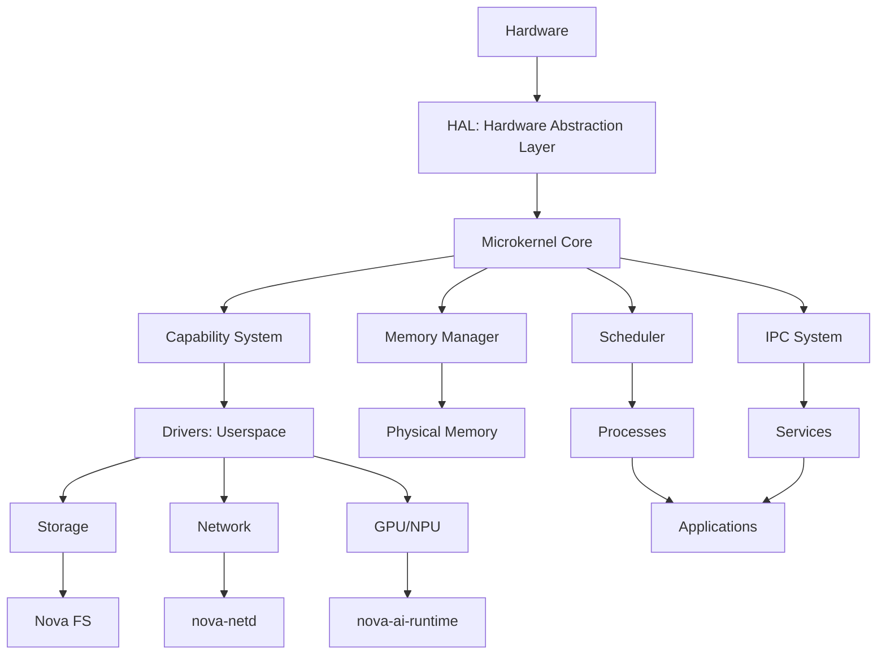

# Nova OS: Feature & Philosophy Comparison Matrix

## 🎯 Philosophy Comparison

| **Philosophy**             | **Nova OS**                              | **Linux**                    | **Windows**                     | **macOS**           | **Qubes OS**                 | **TempleOS**             | **What We Can Learn**                                           |
| -------------------------- | ---------------------------------------- | ---------------------------- | ------------------------------- | ------------------- | ---------------------------- | ------------------------ | --------------------------------------------------------------- |
| **Security Model**         | Capability-based, zero ambient authority | DAC + optional MAC (SELinux) | DAC + UAC + Mandatory Integrity | DAC + Sandbox + SIP | Capability-based (Qubes RPC) | Single-user, no security | ✅ **Best in class** - Pure capability model is most secure     |
| **Kernel Architecture**    | Hybrid microkernel                       | Monolithic                   | Hybrid (NT)                     | Hybrid (XNU)        | Microkernel (Xen)            | Monolithic               | ✅ **Balanced** - Microkernel security + monolithic performance |
| **Driver Model**           | Userspace, isolated processes            | Kernel modules               | Kernel modules                  | Kernel modules      | Userspace (Qrexec)           | Kernel modules           | ✅ **Most reliable** - Driver crashes don't crash system        |
| **Memory Safety**          | Rust + formal verification               | C (unsafe)                   | C/C++ (unsafe)                  | C/Obj-C/Swift       | C (Xen)                      | HolyC (unsafe)           | ✅ **Most advanced** - Compile-time safety                      |
| **Update Mechanism**       | Atomic A/B updates                       | Package manager              | Windows Update                  | macOS Updates       | Qubes RPM                    | Manual                   | ✅ **Most reliable** - No broken updates                        |
| **Privacy Focus**          | Hardware ID randomization                | Limited                      | Telemetry-heavy                 | Strong              | Strong                       | None                     | ✅ **Best for privacy** - Hardware fingerprinting protection    |
| **Performance Philosophy** | Predictive, power-aware                  | Reactive                     | Reactive                        | Reactive            | Security-first               | Minimal overhead         | ✅ **Most innovative** - Proactive optimization                 |
| **Compatibility**          | 3-phase (POSIX → Native → WASM)          | POSIX                        | Win32 + WSL                     | POSIX + Cocoa       | Limited                      | None                     | ✅ **Most flexible** - Gradual transition path                  |
| **Eco-Friendliness**       | Power accounting, old HW support         | None                         | None                            | Some                | None                         | None                     | ✅ **Unique** - Only OS with energy as first-class resource     |
| **AI Integration**         | OS-level runtime, NPU scheduling         | None                         | None                            | Core ML             | None                         | None                     | ✅ **Most advanced** - Native AI support                        |

## 🚀 Feature Comparison Matrix

| **Category**         | **Feature**                 | **Nova OS**   | **Linux**     | **Windows**        | **macOS**        | **Qubes OS** | **TempleOS** | **Best Implementation** | **Nova Improvement**         |
| -------------------- | --------------------------- | ------------- | ------------- | ------------------ | ---------------- | ------------ | ------------ | ----------------------- | ---------------------------- |
| **Kernel**           | Microkernel Architecture    | ✅ Hybrid     | ❌            | ⚠️ Hybrid          | ⚠️ Hybrid        | ✅ Pure      | ❌           | Qubes (security)        | Add formal verification      |
|                      | Memory Safety               | ✅ Rust       | ❌ C          | ❌ C/C++           | ⚠️ Mixed         | ❌ C         | ❌ HolyC     | Nova (Rust)             | Formal verification          |
|                      | Real-time Scheduling        | ✅ Yes        | ⚠️ PREEMPT_RT | ⚠️ Yes             | ❌ No            | ❌ No        | ❌ No        | Nova (built-in)         | Hard real-time guarantees    |
| **Security**         | Capability-Based Security   | ✅ Yes        | ❌ No         | ❌ No              | ❌ No            | ✅ Yes       | ❌ No        | Qubes/Nova              | Pure capability model        |
|                      | Mandatory Access Control    | ✅ Yes        | ⚠️ SELinux    | ✅ Yes             | ✅ Yes           | ✅ Yes       | ❌ No        | Qubes                   | Simpler implementation       |
|                      | Hardware Isolation          | ✅ IOMMU      | ⚠️ Optional   | ⚠️ Yes             | ✅ Yes           | ✅ Strong    | ❌ No        | Qubes                   | Mandatory for all DMA        |
|                      | Verified Boot Chain         | ✅ Yes        | ❌ No         | ⚠️ Secure Boot     | ✅ Yes           | ✅ Yes       | ❌ No        | Qubes/Nova              | TPM integration              |
| **Filesystem**       | Copy-on-Write               | ✅ Yes        | ⚠️ btrfs      | ❌ No              | ✅ APFS          | ❌ No        | ❌ No        | Nova/ZFS                | Built-in, not optional       |
|                      | Per-Block Checksums         | ✅ BLAKE3     | ❌ No         | ❌ No              | ❌ No            | ❌ No        | ❌ No        | Nova (unique)           | Silent corruption prevention |
|                      | Snapshots                   | ✅ O(1)       | ⚠️ btrfs      | ✅ VSS             | ✅ APFS          | ❌ No        | ❌ No        | Nova (fastest)          | Instant, free snapshots      |
|                      | Encryption                  | ✅ ChaCha20   | ⚠️ fscrypt    | ✅ BitLocker       | ✅ FileVault     | ✅ LUKS      | ❌ No        | Nova (TPM-sealed)       | Hardware-bound keys          |
| **Performance**      | Tickless Scheduler          | ✅ NO_HZ_FULL | ⚠️ Partial    | ⚠️ Partial         | ✅ Yes           | ❌ No        | ❌ No        | Nova (full)             | Maximum power savings        |
|                      | Heterogeneous Scheduling    | ✅ P/E cores  | ❌ No         | ⚠️ Thread Director | ✅ Yes           | ❌ No        | ❌ No        | Nova (best)             | AI workload aware            |
|                      | Zero-Copy IPC               | ✅ Yes        | ❌ No         | ❌ No              | ❌ No            | ✅ Yes       | ❌ No        | Qubes/Nova              | Shared memory mapping        |
| **Hardware Support** | Old Hardware Revival        | ✅ Target     | ❌ No         | ❌ No              | ❌ No            | ❌ No        | ❌ No        | Nova (unique)           | <32MB RAM target             |
|                      | RISC-V Support              | ✅ Day 1      | ⚠️ Partial    | ❌ No              | ❌ No            | ❌ No        | ❌ No        | Nova (best)             | First-class architecture     |
|                      | GPU as First-Class Citizen  | ✅ Yes        | ❌ No         | ⚠️ DXGK            | ✅ Metal         | ❌ No        | ❌ No        | Nova (best)             | Unified scheduling           |
| **AI/ML**            | OS-Level Inference Runtime  | ✅ Yes        | ❌ No         | ❌ No              | ⚠️ Core ML       | ❌ No        | ❌ No        | Nova (unique)           | Shared model cache           |
|                      | NPU Scheduling              | ✅ Yes        | ❌ No         | ❌ No              | ⚠️ Neural Engine | ❌ No        | ❌ No        | Nova (unique)           | Kernel-managed               |
|                      | Model Weight Sharing        | ✅ Yes        | ❌ No         | ❌ No              | ❌ No            | ❌ No        | ❌ No        | Nova (unique)           | MemoryCapability             |
| **User Experience**  | Atomic Updates              | ✅ Yes        | ❌ No         | ⚠️ Yes             | ✅ Yes           | ✅ Yes       | ❌ No        | Nova/Qubes              | Instant rollback             |
|                      | Per-App Energy Accounting   | ✅ Yes        | ❌ No         | ❌ No              | ❌ No            | ❌ No        | ❌ No        | Nova (unique)           | mW precision                 |
|                      | Predictive Resource Loading | ✅ Yes        | ❌ No         | ❌ No              | ❌ No            | ❌ No        | ❌ No        | Nova (unique)           | ML-based                     |
| **Development**      | Self-Hosting Compiler       | ✅ Goal       | ❌ No         | ❌ No              | ❌ No            | ❌ No        | ❌ No        | Nova (unique)           | Full ownership               |
|                      | WASM as Primary App Format  | ✅ Yes        | ❌ No         | ⚠️ WASI            | ❌ No            | ❌ No        | ❌ No        | Nova (best)             | Universal binaries           |
|                      | Reproducible Builds         | ✅ Yes        | ⚠️ Partial    | ❌ No              | ❌ No            | ✅ Yes       | ❌ No        | Qubes/Nova              | Bit-for-bit identical        |

## 💡 What Other OSes Do Better (And How Nova Can Improve)

### **From Linux:**

| **Feature**       | **Linux Implementation**               | **Nova Opportunity**                                                     |
| ----------------- | -------------------------------------- | ------------------------------------------------------------------------ |
| Driver Ecosystem  | 30+ years of driver development        | **Nova:** Use Linux driver compatibility shim initially (Phase 1-2)      |
| Filesystem Choice | Multiple FS options (ext4, btrfs, xfs) | **Nova:** Keep single NovaFS but add read-only ext4 driver for migration |
| Container Support | Docker, Kubernetes, LXC                | **Nova:** OCI-compatible container runtime (Vol3 §15)                    |
| Community Scale   | Massive developer community            | **Nova:** Build contributor onboarding early (Vol6)                      |

### **From Windows:**

| **Feature**            | **Windows Implementation**               | **Nova Opportunity**                                        |
| ---------------------- | ---------------------------------------- | ----------------------------------------------------------- |
| Hardware Support       | Broadest driver compatibility            | **Nova:** Prioritize open-source drivers (Intel, AMD)       |
| Gaming Ecosystem       | DirectX, anti-cheat, broad compatibility | **Nova:** Kernel-level anti-cheat attestation (Vol1 §25)    |
| User Experience        | Polished UI/UX                           | **Nova:** Learn from Windows 11's settings app organization |
| Backward Compatibility | Decades of legacy support                | **Nova:** 3-phase compatibility strategy (Vol1 §32)         |

### **From macOS:**

| **Feature**       | **macOS Implementation**               | **Nova Opportunity**                                                     |
| ----------------- | -------------------------------------- | ------------------------------------------------------------------------ |
| Unified Ecosystem | Seamless hardware/software integration | **Nova:** Target specific hardware profiles (Nova Desktop, Mobile, etc.) |
| Power Management  | Excellent battery life                 | **Nova:** Per-process energy accounting (Vol1 §33)                       |
| Security          | Strong sandboxing, SIP                 | **Nova:** Capability model is even stronger                              |
| Developer Tools   | Xcode integration                      | **Nova:** First-class Rust support + WASM tooling                        |

### **From Qubes OS:**

| **Feature**        | **Qubes Implementation**                 | **Nova Opportunity**                                   |
| ------------------ | ---------------------------------------- | ------------------------------------------------------ |
| Security Isolation | VM-based compartmentalization            | **Nova:** Capability-based isolation is lighter weight |
| Verified Boot      | Strong boot chain verification           | **Nova:** TPM + Dilithium signatures (DDR-011)         |
| Disposable VMs     | Temporary, isolated environments         | **Nova:** Ephemeral capability namespaces              |
| Admin API          | Qrexec for secure inter-VM communication | **Nova:** Typed IPC with capability gates              |

### **From TempleOS:**

| **Feature**      | **TempleOS Implementation**           | **Nova Opportunity**                                   |
| ---------------- | ------------------------------------- | ------------------------------------------------------ |
| Simplicity       | ~100KB kernel                         | **Nova:** Microkernel core <200KB (DDR-001)            |
| Single Developer | Proof that one person can build an OS | **Nova:** Bootstrap philosophy (Vol1 §13)              |
| HolyC Language   | Custom language for OS                | **Nova:** Rust is better (memory safety + performance) |
| Philosophy       | Strong, opinionated design            | **Nova:** Clear design principles (Vol1 §3)            |

### **From Fuchsia:**

| **Feature**            | **Fuchsia Implementation**      | **Nova Opportunity**                          |
| ---------------------- | ------------------------------- | --------------------------------------------- |
| Microkernel            | Zircon microkernel              | **Nova:** Hybrid microkernel with better IPC  |
| Capability Model       | Strong capability system        | **Nova:** Similar but with Rust memory safety |
| Component Architecture | Modular, replaceable components | **Nova:** Nova Extensions (Vol1 §21.6)        |
| Language Choice        | Rust + C++                      | **Nova:** Rust-only kernel (simpler)          |

### **From Redox OS:**

| **Feature**     | **Redox Implementation** | **Nova Opportunity**                             |
| --------------- | ------------------------ | ------------------------------------------------ |
| Rust Kernel     | Full Rust microkernel    | **Nova:** Similar but with formal verification   |
| Filesystem      | RedoxFS (CoW)            | **Nova:** NovaFS with BLAKE3 checksums (DDR-009) |
| Package Manager | rbpkg                    | **Nova:** nova-pkg with atomic updates           |
| Philosophy      | Unix-like but modern     | **Nova:** Similar but with capability security   |

---

## **🎨 5. Visual Elements to Add**

### **5.1 Architecture Diagrams (Mermaid.js Examples)**

#### **1. System Architecture Overview**

